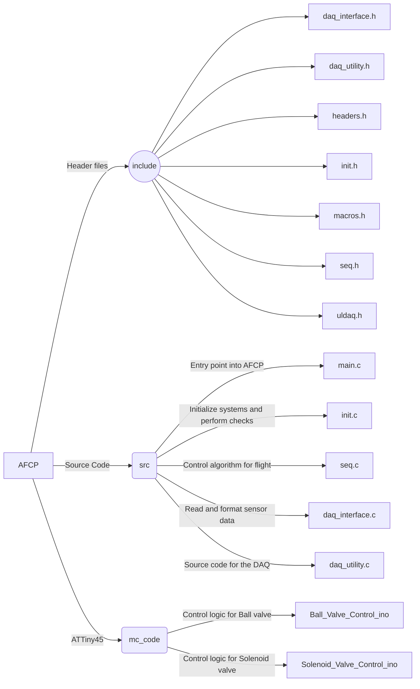

# Helios Rocketry AFCP- _Avionics Flight Computer Program_
The repository manages code for the flight computer for Helios Rocketry. Please find a brief introduction to the system below:
 
## Instructions 
 

Assign yourself a task in the issues tab. Branch the code to work on it, and open a pull request when you
are done coding.

Please comment your code!!!!

  

### main.c:

The main entry point into the code, should not contain any actual code, other than function calls and the definition for reading the config

  
### init.c:

Contains the code for initializing and systems check before the main sequence is run

 

### seq.c:

Contains the code for the main sequence. Loops indefinitely right now, can be changed later

  

### init.h, seq.h, headers.h:

header files for linking all the files together.

  

### macros.h:

Contains macros needed for conversion of values and actuation of valves.

 
## Instruction for execution

- To compile code, type `make` in the terminal.

- To compile code for debugging, type `make debug` in the terminal.

  
- To create a fresh solution in case of a bad compile, or to recompile, type `make clean` and then type one

of the above in the terminal.

  

#### config file format

`<sensor_name>,<base_val>,<pos_val_err>,<neg_val_err>,<base_trend>,<pos_trend_err>,<neg_trend_err>,<pin>`

or

`<valve_name>,<pin>,<feedback>`

  

#### verifiedValue.csv format

`<base_val_sensor_1>,<pos_val_err>,<neg_val_err>,...`

  

#### verifiedTrend.csv format

`<base_trend_sensor_1>,<pos_trend_err>,<neg_trend_err>,...`

